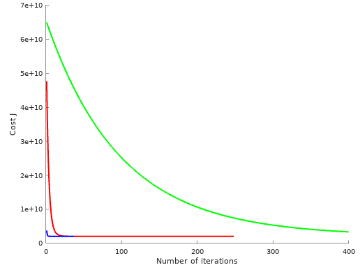

# Week 2

## Resources

* [Octave Doco](https://www.gnu.org/software/octave/doc/interpreter/ )

### Coursera
* [Discussions](https://www.coursera.org/learn/machine-learning/discussions )
* [Matlab learning links](https://www.coursera.org/learn/machine-learning/supplement/Mlf3e/more-octave-matlab-resources )
* [Resources](https://www.coursera.org/learn/machine-learning/resources/QQx8l )
* [Matlab lecture notes](https://www.coursera.org/learn/machine-learning/resources/QQx8l )


## Multiple Features
### Notation
$$\begin{align*}
x_j^{(i)} &= \text{value of feature } j \text{ in the }i^{th}\text{ training example} \\
x^{(i)}& = \text{the feature inputs of the }i^{th}\text{ training example (as a column vector)} \\
m &= \text{the number of training examples} \\
n = \left| x^{(i)} \right| & = \text{(the number of features)} \end{align*} $$

$\forall i \in 1,\dotsc,m$, we assume that $x_0^{(i)} = 1$ so that $x$ matches $\theta$ element-wise. The dimensions of both are $n+1$ due to the intercept term in $\theta$. ($n =$ the number of features).

### Multivariate regression

$$\begin{align}J(\theta) &= \dfrac {1}{2m} \sum _{i=1}^m \Big( \hat{y}_{i}- y_{i} \Big)^2 \\
&= \frac{1}{2m}\sum_{i=1}^{m}\Bigg ( \bigg ( \sum_{j=0}^{n}\theta_j x^{(i)}_j\bigg) - y^{(i)} \Bigg) ^2 \\
\text{Where $\theta \in \Bbb R^{n+1}$:}\\
&= \dfrac {1}{2m} \sum _{i=1}^m \Big ( \theta^Tx^{(i)}- y^{(i)} \Big)^2 \\
&= \dfrac {1}{2m} (X\theta - \vec{y})^{T} (X\theta - \vec{y})
\end{align}$$

In Octave: `J = 1/(2*m) * sum( (X * theta - y).^2 );`, or vectorised:
```
differences = (X * theta - y);
J = 1/(2*m) * differences' * differences;
```

####Batch Gradient descent
Repeat until convergence:
$$\begin{align*}&  \theta_j := \theta_j - \alpha \frac{1}{m} \sum_{i=1}^{m} \left( h_\theta(x^{(i)}) - y^{(i)}\right) \cdot x_j^{(i)} \; & \text{for j := 0...n}\end{align*}$$

## Vectorisation

####Design matrix
For efficiency, the training set matrix is $X \in \Bbb R^{m\times (n+1)}$ where $m$ is the number of training examples and $n$ is the number of features. Each training example is a row, each column is a feature.  $X$ defined this way is called the *design matrix*.  $\vec h(\theta) = X \theta$.

####Vectorised gradient descent
We can vectorise the batch gradient descent formula:
$$ \begin{align}\theta_j &:= \theta_j - \alpha \frac \partial {\partial\theta_j} J(\theta) &&\text{(from week 1)}\\
\theta &:= \theta -\alpha\delta && \text{(vectorised)}\\
\text{where } \delta &= \frac 1 m \sum_{i=0}^m\left(h_{\theta}(x^{(i)}) - y^{(i)}\right)x^{(i)}\end{align}$$

####Matrix notation
$\theta := \theta - \alpha \nabla J(\theta)$ where:

$ \nabla J(\theta)  = \begin{bmatrix}\frac{\partial J(\theta)}{\partial \theta_0}   \newline \frac{\partial J(\theta)}{\partial \theta_1}   \newline \vdots   \newline \frac{\partial J(\theta)}{\partial \theta_n} \end{bmatrix}$

$\;$

$\begin{align}
\frac{\partial J(\theta)}{\partial \theta_j} &= \frac{1}{m} \sum\limits_{i=1}^{m}  \left(h_\theta(x^{(i)}) - y^{(i)} \right) \cdot x_j^{(i)} \\[3pt]
&= \frac{1}{m} \sum\limits_{i=1}^{m}   x_j^{(i)} \cdot \left(h_\theta(x^{(i)}) - y^{(i)}  \right) \quad \text{(transposing terms)}
\end{align}$

The $x^{(i)}_j$ above, for i = 1,...,m, represents the $m$ elements of the $j$-th column, $\vec{x_j}$, of the training set $X$.

$\begin{align} \frac{\partial J(\theta)}{\partial \theta_j} &= \frac1m  \vec{x_j}^{T} (X\theta - \vec{y}) \\[6pt]
\nabla J(\theta) &= \frac 1m X^{T} (X\theta - \vec{y})  \quad \text{(multiplying by all columns)}\end{align}$

So the vectorised gradient descent is:
$\begin{align*}\theta &:= \theta - \displaystyle \frac{\alpha}{m} X^{T} (X\theta - \vec{y})\end{align*}$

## Normal equations

To find $\theta$ which minimises $J(\theta)$ set all partial derivatives $\frac \partial {\partial\theta_i}J=0$ and solve for $\theta_i \forall i \in \{0, \dotsc, n\}$.

* [Derivation of the Normal Equation for linear regression](http://eli.thegreenplace.net/2014/derivation-of-the-normal-equation-for-linear-regression )
* [Wikipedia's (hairy) Derivation of the normal equations](https://en.wikipedia.org/wiki/Linear_least_squares_(mathematics%29#Derivation_of_the_normal_equations )

Vectorised, to find $ \min_{\theta} J(\theta)$
$$ \theta =  (X^TX)^{-1}X^Ty$$

Feature scaling is not required -- this is not an iterative approach.

In Octave, use `pinv` (pseudoinverse) rather than `inv` as $X^TX$ will be *noninvertible* if it is *singular* or *degenerate*.

Two common causes of $X$ being singular:
 * Redundant features (linearly dependent, eg size in both feet and metres)
 * Too many features ($m \le n$)
   * Delete some features, or use regularisation

**Advantages**
 * No need to choose $\alpha$
 * No need to iterate until convergence
   * No need to regularise

**Disadvantages**
 * Doesn't work with some algorithms (eg logistic regression)
 * May not work if $m \le n$ (noninvertable)
 * Doesn't scale well with large $n$ (many features)
   * Becomes an issue around $n = 10,000$
   * $X^TX$ is an $n+1 \times n+1$ matrix
   * Computing the pseudoinverse is $O(n^3)$ (actually slightly faster)
     * Gradient descent is $O(kn^2)$)

###Feature scaling

Gradient descent can be optimised by adjusting the ranges of input values to have roughly the same range. This is because $\theta$ will descend quickly on small ranges and slowly on large ranges, oscillating (due to steep valley of the elongated contours) inefficiently down to the optimum when the ranges are very uneven.

To scale, divide each element by the range, or by the largest value.

Generally the range desired is around $-1 \le x_i \le 1$, but $\frac 1 3 \le |x_i| \le 3$ is ok.

Do not apply feature scaling to $x_0$ as it should $ = 1$.

####Mean normalisation

$x_i := \dfrac{x_i - \mu_i}{s_i}$

Where $\mu_i$ is the average of all the values for feature $i$ and $s_i$ is either the range of values (max - min), or standard deviation.

This will map the mean value to 0.

### Debugging gradient descent / choosing $\alpha$

If working correctly, $J(\theta)$ should decrease after each iteration. Plotting this makes for an easy visual check of when convergence occurs as the iterations required varies quite a bit with different applications. Andrew prefers the graph as it shows *how* convergence happens rather than an automatic convergence test (eg $\epsilon \lt 10^{-3}$).

If $J(\theta)$ ever increases, try a smaller value of $\alpha$.

See if $\alpha$ can be increased to reduce the number of iterations required for convergence.

Andrew scales the value of $\alpha$ by approximately 3 (eg 0.1, 0.3, 1, 3) when tuning it.

My initial implementation iteratively multiplied $\alpha$ buy 1.1 until the cost started to increase. A better solution would be to do a binary search. Spending 20 iterations doing a binary search for best $\alpha$ has a large impact on the number of iterations for convergence:


### Combining features

Features may be combined eg the area of land given frontage and depth.

### Polynomial regression

Polynomial functions may fit the data much better. Feature scaling is important as the ranges easily differ by orders of magnitude.

## Matlab / Octave Tutorial

In Silicon valley, a HLL like Octave/Matlab is used to prototype, and another language like Java only used for a large scale implementation.

Prototyping is usually done in: Matlab, Octave. Python, NumPy (syntax is slightly clunkier), and R.

Specifying a vector defaults to a row vector (unless `;` is used).

`max(A)` does the column-wise maximum of matrix `A`.

`find(a < 3)` will return the indexes of all matching elements.

The first dimension is column-wise, 2nd is row-wise.

*Vectorisation* changes code that relies on loops and converts it into matrix operations. It is more efficient, more elegant, and more concise.

[//]: #speeling (check)
