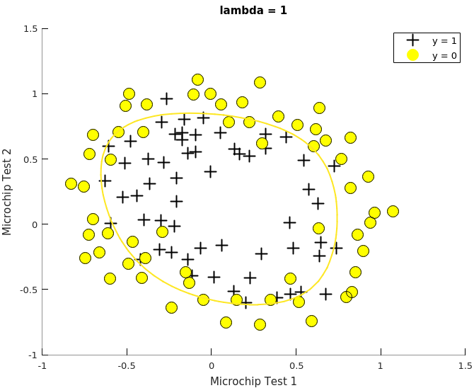
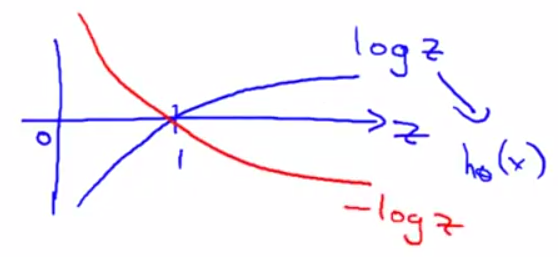
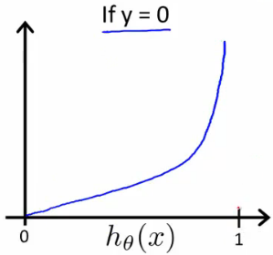
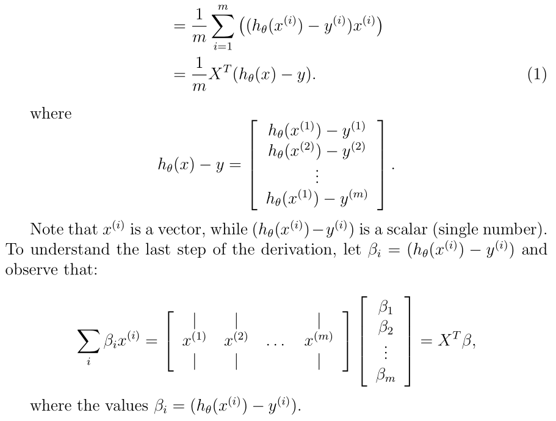
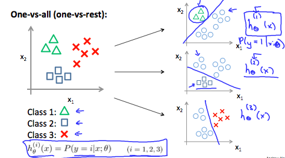
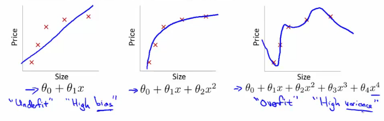

# Machine Learning - Week 3

## Binary Classification
Classification is where $y$ takes discrete values, ie, $y \in \{0,1\}$.

* Class "0" or "$-$" -- the *negative class* (generally denotes absense)
* Class "1" or "$+$" -- the *postitive class* (generally denotes presence)

Assigning which case is the positive class is somewhat arbitrary and depends on viewpoint (eg a ham/spam classifier).

The $y$ value for a given training example is called the *label*.

### Logistic Regression
The name is historical - it is not used for regression problem, it's a classification algorithm.

In logistic regression, $0 \le h_\theta(x) \le 1$.

Using linear regression doesn't work - classification is not a linear function: a single outlier would skew the fit line, and also allow for values outside the interval $(0, 1)$.

### Hypothesis representation

We use the "Sigmoid Function," also called the "Logistic Function" to map any real number to the interval $(0, 1)$:

$$\begin{align*}
& h_\theta (x) =  g ( \theta^T x ) \\[6pt]
& z = \theta^T x \\
& g(z) = \dfrac{1}{1 + e^{-z}}
\end{align*}$$

$\begin{align*}z=0,  e^{0}=1 \Rightarrow  g(z)=\textstyle\frac1 2\newline z \to \infty, e^{-\infty} \to 0 \Rightarrow g(z)=1 \newline z \to -\infty, e^{\infty}\to \infty \Rightarrow g(z)=0 \end{align*}$

$h_\theta(x)$ gives the *probability* that the output is positive.

$$\begin{align*}
h_\theta(x) &= P(y=1 \mid x ; \theta) \\
&= 1 - P(y=0 \mid x ; \theta) \\[6pt]
1 &= P(y = 0 \mid x;\theta) + P(y = 1 \mid x ; \theta)\\
\end{align*}$$

This form is pronounced "P of $y=1$ given x, parameterised by theta"


[Interactive sigmoid graph](https://www.desmos.com/calculator/bgontvxotm ), and [my version](https://www.desmos.com/calculator/plyxs6mqjl )

## Feature mapping

Sometimes extra features need to be generated as a linear decision boundary will not correctly classify data, eg:



These can be created by combining various powers of $x$ and $y$. See file mapFunction.m.

$\ 1 ,\ x_1 ,\ x_2 ,\ x_1^2 ,\ x_1x_2 ,\ x_2^2 ,\ x_1^3 ,\ x_1^2x_2 ,\ x_1x_2^2 ,\ x_2^3 ,\ x_1^4 ,\ x_1^3x_2 ,\ x_1^2x_2^2 ,\ x_1x_2^3 ,\ x_2^4 ,\ x_1^5 ,\ x_1^4x_2 ,\ x_1^3x_2^2 ,\ x_1^2x_2^3 ,\ x_1x_2^4 ,\ x_2^5 ,\ x_1^6 ,\ x_1^5x_2 ,\ x_1^4x_2^2 ,\ x_1^3x_2^3 ,\ x_1^2x_2^4 ,\ x_1x_2^5 ,\ x_2^6$

## Decision boundary

In order to get discrete 0 or 1 classification, we can define the hypothesis function as follows:

$h_\theta(x)= \begin{cases}
1, & \text{if}\; \theta^Tx \ge 0 \left(\implies \dfrac{1}{1 + e^{-\theta^Tx}} \ge 0.5 \right)\\[6pt]
0, & \text{if}\; \theta^Tx \lt 0 \left(\implies \dfrac{1}{1 + e^{-\theta^Tx}} \lt 0.5 \right)\\
\end{cases}$

The decision boundary is the line of points where $h_\theta(x) = 0.5$, determined by the value of $\theta$.

$y = 1 \implies \begin{align}&\\
\theta_0 + \theta_1 x_1 + \theta_2 x_2 + \dots &\ge 0 \\
\theta_1 x_1 + \theta_2 x_2 + \dots &\ge -\theta_0
\end{align}$

The decision boundary is a property not of the training set, but of the hypothesis, ie the values of $\theta$.

The decision boundary could be a circle or any other higher-order polynomial function.

## Cost function for Logistic Regression

Logistic regression needs a different cost function than linear regression because the sigmoid function will cause the output to be non-convex, ie, wavy, having local minima which are not the global minimum.
[Why MSE cost function is wavy for logistic regression](https://www.coursera.org/learn/machine-learning/discussions/all/threads/TrLgeBDaEeeiVhIT9Mn0IA )

To get guaranteed convex functions, we define:

$$\begin{align*}
J(\theta) &= \dfrac{1}{m} \sum_{i=1}^m \mathrm{Cost}(h_\theta(x^{(i)}),y^{(i)}) \\
\mathrm{Cost}(h_\theta(x),y) &=
  \begin{cases}
    -\log(1-h_\theta(x)) \; & \text{if y = 0} \\
    -\log(h_\theta(x)) \; & \text{if y = 1} \\
  \end{cases}
\end{align*}$$

This uses *maximum likilihood estimation* from statistics.

If $y=1$:

As $0 \le h_\theta(x) \le 1$, we're only interested in the interval $(0,1)$.

If $y=0$:


The cost function is simplified as:
$$ \require{cancel}
J(\theta) = - \frac{1}{m} \displaystyle \sum_{i=1}^m \left[y^{(i)}\log \big(h_\theta (x^{(i)})\big) + (1 - y^{(i)})\log \big(1 - h_\theta(x^{(i)})\big)\right] \\[6pt]
$$

Which given $y \in \{0, 1\}$ evaluates to:

$$ J(\theta) =
  \begin{cases}
  \displaystyle - \frac{1}{m} \sum_{i=1}^m \left[\cancel{0 \cdot \log (h_\theta (x^{(i)}))} + \cancel{(1 - 0)}\log (1 - h_\theta(x^{(i)}))\right] \quad \text{if $y=0$}\\
  \displaystyle - \frac{1}{m} \sum_{i=1}^m \left[y^{(i)}\log (h_\theta (x^{(i)})) + \cancel{(1-1) \log (1 - h_\theta(x^{(i)}))}\right] \quad \text{if $y=1$}\\
  \end{cases}
$$

Vectorised:

$$\begin{align*}
  h &= g(X\theta)\\
  J(\theta) &= \frac{1}{m} \left(-y^{T}\log(h) - (1-y)^{T}\log(1-h)\right) \end{align*}$$

$$ \begin{align*}& \mathrm{Cost}(h_\theta(x),y) = 0 &&\text{ if } h_\theta(x) = y \\
& \mathrm{Cost}(h_\theta(x),y) \rightarrow \infty &&\text{ if } y = 0 \; \mathrm{and} \; h_\theta(x) \rightarrow 1 \\
& \mathrm{Cost}(h_\theta(x),y) \rightarrow \infty &&\text{ if } y = 1 \; \mathrm{and} \; h_\theta(x) \rightarrow 0 \newline
\end{align*}$$

## Gradient descent

The gradient descent formula (and [$\nabla J$](https://www.coursera.org/learn/machine-learning/resources/Zi29t )) is exactly the same as for linear regression:

$ \displaystyle \begin{align}\theta_j &:= \theta_j - \alpha \frac \partial {\partial\theta_j} J(\theta) &&\text{(from week 1)} \end{align}$

Repeat until convergence (simultaneously):
$\text{For j := 0...n:} \quad \displaystyle \theta_j := \theta_j - \alpha \frac{1}{m} \sum_{i=1}^{m} \left( h_\theta(x^{(i)}) - y^{(i)}\right) \cdot x_j^{(i)}$


**Note** that while the formulae are the same, the function $h_\theta(x)$ is different.

Vectorised:
$\begin{align*}\vec\theta &:= \vec\theta - \displaystyle \frac{\alpha}{m} X^{T} \big(g(X\theta) - \vec{y}\big)\end{align*}$

Here $X^T$ has rows of features ($x_j^{(i)}$), which when multiplied by the vector of predicted vs actual differences gets summed from $1...m$ becoming a vector.



### Feature scaling

Feature scaling will also have gradient descent run faster for logistic regression.

## Advanced optimisation

More sophisticated, faster ways to optimize $\theta$:
* Conjugate gradient
* BFGS
* L-BFGS

Advantages:
* No need to pick $\alpha$
  * Line search algorithm tries out different values for $\alpha$, even on each iteration.
* Converge much faster than gradient descent (generally)

Disadvantage:
* Complex (don't implment unless versed in advanced numerical methods)

All of these (and gradient decent) require functions which give:
 * $J(\theta)$
 * $\nabla J$

## Multi-class classification - *one vs all*

Instead of $y \in {0,1}$ we will expand our definition so that $y \in {0,1...n}$.

Train a logistic regression classifier $h_\theta^{(i)}$ for each class $i$ to predict the probability of $y = i$.

On a new input $x$, pick the class $i$ that maximises: $\max\limits_{i} h_\theta^{(i)}(x)$

Andrew tends to index his multi-classes not from $0$ but from $1$.



### Octave

Create a function which returns both cost and gradient:

```
function [jVal, gradient] = costFunction(theta)
  jVal = [...code to compute J(theta)...];
  gradient = [...code to compute derivative of J(theta)...];
end
```

Set the options with `optimset`, then pass to `fminunc` (Function MINimisation UNconstrained)

```
options = optimset('GradObj', 'on', 'MaxIter', 100);
  initialTheta = zeros(2,1);
  [optTheta, functionVal, exitFlag] = fminunc(@costFunction, initialTheta, options);
```

Unconstrained refers to the lack of constraints that the parameters (elements of $\theta$) can take (any real number).

Return value $1$ indicates convergence based upon $\epsilon$.

In other languages, try a few different libraries - not all implementations are created equal!

## Overfitting

If there are too many features and not enough training data, the learned hypothesis may fit the training set very tightly ($J(\theta) \approx 0 $) but fail to generalise to new examples.

Applies both to linear regression and logistic regression.


Fit (left to right):
1. *Underfitting* ("high bias" or preconception of what the function should be)
2. Good fit
3. *Overfitting* ("high variance" - a very high order polynomial could fit almost any data set, not enough data to constrain it for a good hypothesis)


### Reducing overfitting

Two main options:

1. Reduce the number of features
  * Manually select which features to keep
    * Use a model selection algorithm (studied later in the course)
  * Disadvantage: throws away useful data

2. Regularization
  * Keep all the features, but reduce the magnitude/values of parameters $\theta_j$
  * Works well with many slightly relevant features

[Desmos Regressions - Easily pick functions which match data points](http://learn.desmos.com/regressions )

## Regularisation of cost function
We can reduce the overfit effect of the higher order terms by penalising them:

$$\displaystyle \min_\theta\ \dfrac{1}{2m}\  \sum_{i=1}^m (h_\theta(x^{(i)}) - y^{(i)})^2 + 999\theta_2^2 + 999\theta_3^2 $$

The weighted terms will need to $ \approx 0$ for the function as a whole to be minimised.

Generally, smaller values for $\theta_j$ will lead to a "simpler", smoother hypothesis, less prone to overfitting, given by:

$$\min_\theta\ \dfrac{1}{2m}\  \sum_{i=1}^m (h_\theta(x^{(i)}) - y^{(i)})^2 + \left[ \lambda\ \sum_{j=1}^n \theta_j^2 \right]$$

This will encourage having fewer features, as adding a feature (non-zero $\theta_j$) will incur a cost.

Where $\lambda$ is the regularisation parameter, determining the $\theta_j$ parameter cost inflation.

By convention, regularisation is not applied to the intercept term $j=0$.

Small $\lambda$ prefers fitting the training set closely (possible overfitting). Large $\lambda$ is a preference for fewer features and underfitting.

In Lasso regression, $\lambda \left| \beta \right|$ is added to the SSE (Sum Squared Errors) cost.

Effect of changing $\lambda$:


## Regularised linear regression

### Gradient descent

$$\begin{align*}
& \text{Repeat}\ \lbrace \\
& \ \ \ \ \theta_j :=  \begin{cases}
  \displaystyle \theta_j - \alpha\ \frac{1}{m}\ \sum_{i=1}^m \big(h_\theta(x^{(i)}) - y^{(i)}\big)x_0^{(i)}, \quad & \text{if $j=0$}\\[4ex]

  \displaystyle \theta_j - \alpha\ \left[ \left( \frac{1}{m}\ \sum_{i=1}^m \big(h_\theta(x^{(i)}) - y^{(i)}\big)x_j^{(i)} \right) + \frac{\lambda}{m}\theta_j \right], & \text{if}\; j \in \lbrace 1,2...n\} \\[2ex]

  \displaystyle = \theta_j(1 - \alpha\frac{\lambda}{m}) - \alpha\frac{1}{m}\sum_{i=1}^m(h_\theta\big(x^{(i)}) - y^{(i)}\big)x_j^{(i)} & \text{(factorising for $\theta_j$)}
  \end{cases} \\
& \rbrace
\end{align*}$$

The first term, $1 - \alpha\frac{\lambda}{m}$ should always be $ \lt 1$, reducing the value of $\theta_j$ by some amount on every update. The second term is now exactly the same as the non-regularised equation.

## Regularised logistic regression Octave code:
```Matlab

function [J, grad] = costFunction(theta, X, y)
  m = length(y); % number of training examples
  hX = sigmoid(X * theta);
  J = (-y' * log(hX) - (1 - y')*log(1 - hX)) / m;
  grad = 1/m * X' * (hX - y);
end

function [J, grad] = logisticRegularisedCostFunction(theta, X, y, lambda)
  m = length(y); % number of training examples
  hX = sigmoid(X * theta);
  % Ones only for elements 2:end
  regularisationMask = ones(size(theta)) - eye(size(theta));

  [J, grad] = costFunction(theta, X, y);

  J += lambda / 2 / m * theta' * (theta .* regularisationMask);
  grad += lambda * theta .* regularisationMask / m;
end
```

### Normalisation

The equation is the same as before with the addition of the $\lambda$ term inside the parentheses:

$$\begin{align*}& \theta = \left( X^TX + \lambda \cdot L \right)^{-1} X^Ty \newline& \text{where}\ \ L = \begin{bmatrix} 0 & & & & \newline & 1 & & & \newline & & 1 & & \newline & & & \ddots & \newline & & & & 1 \newline\end{bmatrix}\end{align*}$$

$L$ is $I_{n+1}$ with $L_{1,1} = 0$. Intuitively, we are multiplying the identity matrix by a constant, $\lambda$.

Recall that if $m \le n$, then $X^TX$ is non-invertible. However, when we add the term $\lambda \cdot L$, then $X^TX + \lambda⋅L$ becomes invertible if $\lambda \gt 0$, allowing use of `inv` rather than `pinv` ([Result of `pinv` will be the same as `inv` if matrix is invertible](https://math.stackexchange.com/q/1871297/389109 )).

## Regularised logistic regression

### Cost function

Cost function for logistic regression:

$$J(\theta) = - \frac{1}{m} \sum_{i=1}^m \left[ y^{(i)}\ \log \big(h_\theta (x^{(i)})\big) + (1 - y^{(i)})\ \log \big(1 - h_\theta(x^{(i)})\big) \right]$$

Regularise by adding a term to the end:

$$J(\theta) = - \frac{1}{m} \sum_{i=1}^m \left[ y^{(i)}\ \log \big(h_\theta (x^{(i)})\big) + (1 - y^{(i)})\ \log \big(1 - h_\theta(x^{(i)})\big) \right] + \frac{\lambda}{2m}\sum_{j=1}^n \theta_j^2$$

NB: The bias term, $\theta_0$ is explicitly excluded from regularisation.

### Gradient Descent

The gradient descent formula is exactly the same as for linear regression, but the algorithm is different due to the definition of $h_\theta(x)$.

### Implementation
```
regressionMask = ones(size(theta)) - eye(size(theta));

[J, grad] = costFunction(theta, X, y);

J += lambda / 2 / m * theta' * (theta .* regressionMask);
grad += lambda * theta .* regressionMask / m;
```

[//]: #speeling (check)
