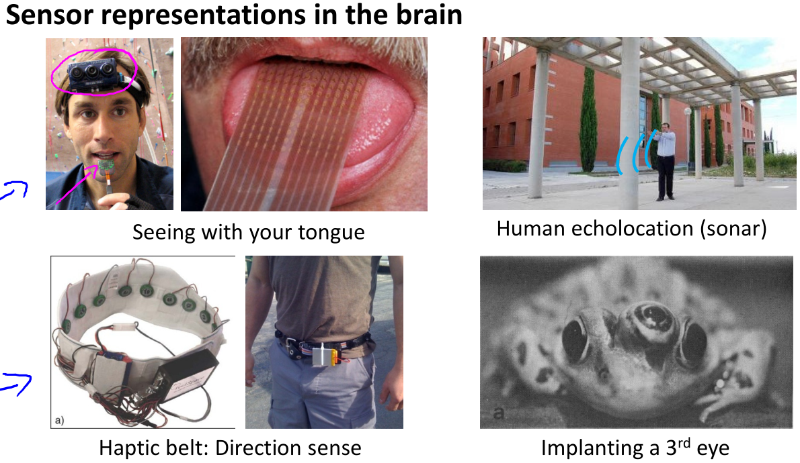
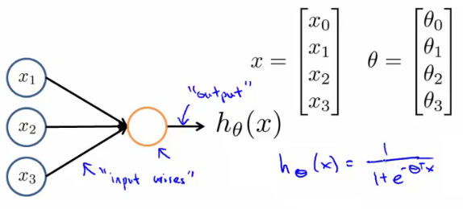
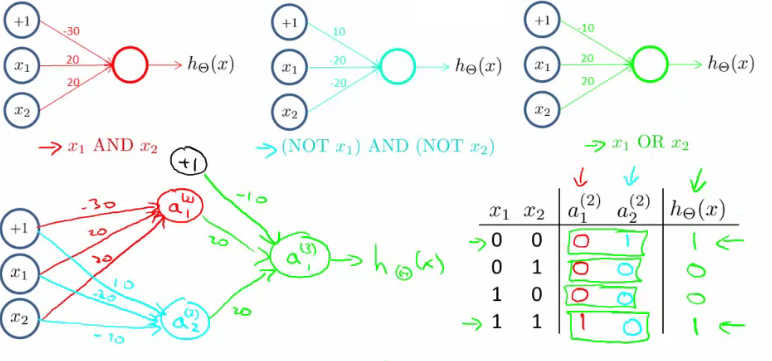

# Machine Learning - Week 4

## Neural Networks

### The problem with non-linear classifiers

The number of generated features needed to generate a function fitting the training set grows exponentially with the number of initial features.

Eg, for a 2nd [degree](https://en.wikipedia.org/wiki/Degree_of_a_polynomial ) function with 100 features, $ n = 5050$.

If using only 50x50 pixel images, there are 2500 pixels, and 7500 features if using RGB. With a quadratic equation, this would be over 3,000,000 features (for the greyscale case!).

The exact way to calculate how many features for all polynomial terms is [combination function with repetition](http://www.mathsisfun.com/combinatorics/combinations-permutations.html ): $\frac{(n+r-1)!}{r!(n-1)!}$

The number of new features with all quadratic terms $ \approx \mathcal O(n^2/2)$. Include all cubic terms in your hypothesis: $\mathcal{O}(n^3)$.

Neural networks are a better way of learning complex non-linear hypotheses even with a large feature space.

## History of neural networks

Originated in the 80s and early 90s where algorithms tried to mimic the human brain. A more recent resurgence around 2010. 

Neural networks are more computationally expensive, only feasible to run them on recent hardware.

NNs are currently state-of-the-art for many applications.

There is a hypothesis that the brain uses only one "learning algorithm" for all its different functions. Scientists have rewired the optical nerve with the auditory cortex to find that the auditory cortex literally learns to see.

This principle is called "neuroplasticity".

The brain learns to process and use any input supplied to it.

# Model representation

### Neurons

[Wikipedia](https://en.wikipedia.org/wiki/Neuron ) says:
> A neuron is an electrically excitable cell that processes and transmits information through electrical and chemical signals. These signals between neurons occur via specialized connections called synapses.

Three things to notice
1. Cell body
2. Numerous dendrites (input wires)
3. Single axon (output wire), splitting to multiple attachment points

Function
1. Neuron gets one or more inputs through dendrites - think $x$
1. Does processing
1. Sends output (electric spike) down axon - think $\theta^Tx$

### Logistic unit

Visually, a simplistic representation looks like:

$\begin{bmatrix}x_0 \newline x_1 \newline x_2 \newline \end{bmatrix}\rightarrow\begin{bmatrix}\ \ \ \newline \end{bmatrix}\rightarrow h_\theta(x)$

Sometimes a *bias unit* or *bias neuron* $x_0 = 1$ is drawn when useful.

NN neurons use the same function as logistic regression, but it's called a *sigmoid (logistic) activation function*.

Instead of calling $\theta$ the parameters, it is sometimes called the model's *weights*.

### Layers
Layer order (left to right):
1. The input layer ($x_1$ to $x_n$)
2. Hidden layer(s)
   * Values are not observable
   * Compute functions of increasing complexity
3. Output layer - single neuron giving $h\Theta(x)$

### Notation

*Activation* means the value computed and output by that unit.

$$\begin{align*}& a_i^{(j)} = \text{"activation" of unit $i$ in layer $j$} \newline& \Theta^{(j)} = \text{matrix of weights controlling function mapping from layer $j$ to layer $j+1$}\end{align*}$$

$$\begin{bmatrix}x_0 \newline x_1 \newline x_2 \newline x_3\end{bmatrix}\rightarrow\begin{bmatrix}a_1^{(2)} \newline a_2^{(2)} \newline a_3^{(2)} \newline \end{bmatrix}\rightarrow h_\theta(x)$$

Each layer has its own matrix of weights, $\Theta^{(j)}$.   
If a network has $s_j$ units in layer $j$ and $s_{j+1}$ units in layer $j+1$, then $\Theta^{(j)}$ will be of dimension $s_{j+1} \times (s_j + 1)$.

The *rows* represent the output / activation nodes - a $\theta^T$ vector for each.
The *columns* are coefficients/weights to apply to the inputs (plus bias node), total $s_j + 1$.  

Each activation node's input is a weighted linear combination of the input nodes.  
This sum is then passed through the sigmoid function to the next layer:

$$\begin{align*}
a_1^{(2)} &= g(\Theta_{1,0}^{(1)}x_0 + \Theta_{1,1}^{(1)}x_1 + \Theta_{1,2}^{(1)}x_2 + \Theta_{1,3}^{(1)}x_3) \newline
a_2^{(2)} &= g(\Theta_{2,0}^{(1)}x_0 + \Theta_{2,1}^{(1)}x_1 + \Theta_{2,2}^{(1)}x_2 + \Theta_{2,3}^{(1)}x_3) \newline
a_3^{(2)} &= g(\Theta_{3,0}^{(1)}x_0 + \Theta_{3,1}^{(1)}x_1 + \Theta_{3,2}^{(1)}x_2 + \Theta_{3,3}^{(1)}x_3) \newline
h_\Theta(x) = a_1^{(3)} &= g(\Theta_{1,0}^{(2)}a_0^{(2)} + \Theta_{1,1}^{(2)}a_1^{(2)} + \Theta_{1,2}^{(2)}a_2^{(2)} + \Theta_{1,3}^{(2)}a_3^{(2)}) \newline
\end{align*}$$

### Vectorised notation

Setting $x=a^{(1)}$, we can rewrite the above equations as:

$z^{(j+1)} = \Theta^{(j)}a^{(j)}$

$a^{(j+1)} = g(z^{(j+1)}) = \mathrm{sigmoid}(\Theta^{(j)}a^{(j)})$

### Forward propagation

Forward propagation takes the input layer and sequentially applies the weighted transforms of each of the hidden layers and output layer.  Sometimes called *feed forward*.

Think of each layer as a matrix: a list of nodes (rows). Think of each node as being an (input-layer-numbered) $\theta$ which combines (weighted sum) its inputs as: $\theta^T a^{(j-1)}$, and outputs the sigmoid.

The last unit may be a simple logistic regression, combining the inputs and outputting $\mathrm{sigmoid}(\theta^T a^{(j-1)})$.

The hidden layers elegantly calculate interesting combinations of features, allowing complex, non-linear hypotheses. Later layers calculate more complex functions.

Neural networks learn their own useful features.

## Example and intuitions

XOR is a non-linear function which can be quite easily represented in neural networks.

$$\begin{alignat}{1}
& \mathrm{sigmoid}(+4.6) & \gt 0.99 && \approx 1 \\
& \mathrm{sigmoid}(-4.6) & \lt 0.01 && \approx 0
\end{alignat}$$

Logical *OR* can be implemented with $\Theta = \begin{bmatrix}-10 & 20 & 20\end{bmatrix}$:

### Multi-class classification

For multi-class classification, the output layer has as many nodes as there are classes.  The final layer returns a vector.

Eg, if there are 4 types of picture, we define the training set examples as:

$x^{(i)}$ are the pictures, $\quad y^{(i)} \in \left\{
  \begin{bmatrix}1 \\ 0 \\ 0 \\ 0 \end{bmatrix},
  \begin{bmatrix}0 \\ 1 \\ 0 \\ 0 \end{bmatrix},
  \begin{bmatrix}0 \\ 0 \\ 1 \\ 0 \end{bmatrix},
  \begin{bmatrix}0 \\ 0 \\ 0 \\ 1 \end{bmatrix}
\right\}$ where each vector represents one class of picture.

$h_\Theta(x) \in \Bbb R^4$:

$$\begin{align*}\begin{bmatrix}x_0 \newline x_1 \newline x_2 \newline\cdots \newline x_n\end{bmatrix} \rightarrow\begin{bmatrix}a_0^{(2)} \newline a_1^{(2)} \newline a_2^{(2)} \newline\cdots\end{bmatrix} \rightarrow\begin{bmatrix}a_0^{(3)} \newline a_1^{(3)} \newline a_2^{(3)} \newline\cdots\end{bmatrix} \rightarrow \cdots \rightarrow\begin{bmatrix}h_\Theta(x)_1 \newline h_\Theta(x)_2 \newline h_\Theta(x)_3 \newline h_\Theta(x)_4 \newline\end{bmatrix} \end{align*}$$

[//]: #speeling (check)

# Pomodoros
## Monday
1. Close down Wk3, setup Wk4
1. Video: non-linear hypothesis 
1. Neurons and the brain
1. 8 minutes of Model representation
## Tuesday
1. Understand $\Theta$, 7 minutes.
1. 6 min to Model II 9:11

## Thursday
1. Revision
1. Revision
1. DisplayDecisionBoundry understanding
1. Wrap up loose ends wk3

Paypal from agama?
Phone space

Buy Etherium. 2000
