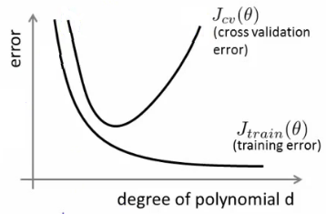
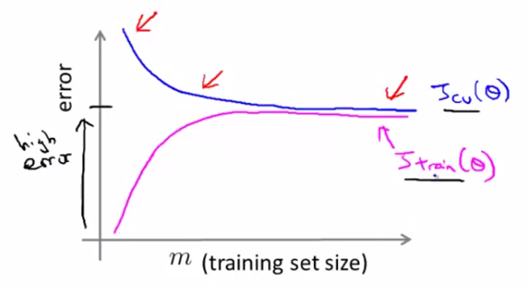
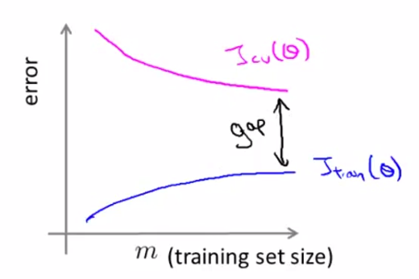
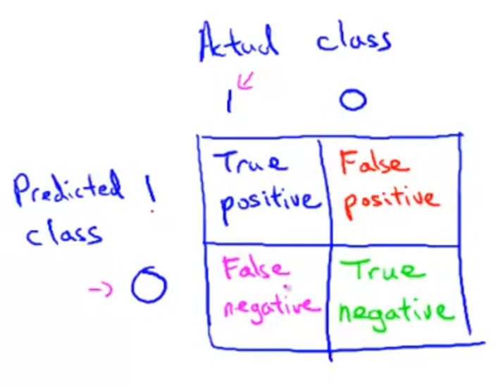

# Machine Learning - Week 6 - Advice for Applying Machine Learning

When we have poor prediction performance, we can:

* Get more training examples (can be difficult, expensive)
* Try smaller sets of features (to prevent overfitting)
* Try additional features (which may be more informative)
* Try polynomial features
* Increase or decrease $\lambda$

Don't apply at random - gathering more training data could take months. For diagnosis and the decision guidance, see below.

## Machine learning diagnostics

Diagnostics can take some time to implement, but can be a very good use of time. Reconnaissance time is seldom wasted.

## How to evaluate a hypothesis

Due to overfitting, a hypothesis may have a low error for the training examples but fail to generalise to unseen examples. 

With many variables, visualising the hypothesis function to look for overfitting becomes difficult.

The training set is not a valid estimate of the hypothesis' fitness.  It's important to have a separate set of data (randomised, about 30% of total) to evaluate a hypothesis. 

The new procedure using these two sets is then:

1. Learn $\Theta$ and minimize $J_{train}(\Theta)$ using the training set
2. Compute the test set error $J_{test}(\Theta)$

### Test set error

The standard definitions of the cost functions can be used for $J_{test}(\Theta)$ for both linear regression and classification.

Additionally, for classification, the *0/1 misclassifiction error* can be used:

$$err(h_\Theta(x),y) = \begin{cases} 1 & \mbox{if } h_\Theta(x) \geq 0.5\ and\ y = 0\ or\ h_\Theta(x) < 0.5\ and\ y = 1\newline 0 & \mbox otherwise \end{cases}$$

This gives us a binary 0 or 1 error result based on a misclassification. The average test error for the test set is:

$$\text{Test Error} = \dfrac{1}{m_{test}} \sum^{m_{test}}_{i=1} err(h_\Theta(x^{(i)}_{test}), y^{(i)}_{test})$$

This gives us the proportion of the test data that was misclassified as a number between 0 and 1.

## Model Selection and Train/Validation/Test Sets

Model selection problems include:
* How to choose the degree of polynomial to apply?
* What is the best value of $\lambda$?

Data sets:
* 60% - Training - find optimum $\Theta$
* 20% - Cross validation (CV) - find optimum polynomial degree
* 20% - Test - evaluate performance on previously unseen data

The *degree* or order of polynomial, "$d$" can be considered another parameter which needs to be chosen.

If we used the test set to pick the degree and measure performance, we would underestimate the generalisation error on unseen examples.

The error of the hypothesis as measured on the data set used to train the parameters will be lower than the error on any other data set.

We calculate 3 separate error values:
1. Training set: Get best $\Theta$s for each degree $d$
2. CV set: Find the $d$ which then gives the lowest cost
3. Test set: Estimate the generalization error: $J_{test}(\Theta^{(d)})$

This way, the degree of the polynomial $d$ has not been trained using the test set.

(Mentor note: be aware that using the CV set to select $d$ means that we cannot also use it for the validation curve process of setting the $\lambda$ value).

**Notation**: Subscripts like $m_{cv}$ and $m_{test}$ are used to denote the number of examples. The training set may be unadorned by subscripts.

## Diagnosing Bias vs. Variance

The most common problems contributing to bad predictions are:

* High bias (underfitting), or
* High variance (overfitting)

The training error will tend to **decrease** as we **increase** the degree $d$ of the polynomial.

The cross validation error will tend to decrease as we increase $d$ up to a point, and then it will increase as $d$ is increased, forming a convex curve.

## Regularization and Bias/Variance

Now we look at $\lambda$ instead of the degree $d$:

* Large λ: High bias (underfitting)
* Intermediate λ: just right
* Small λ: High variance (overfitting)

A **large lambda** heavily penalizes all the $\Theta$ parameters, which greatly simplifies the line of our resulting function, so **causes underfitting**.

### How to choose model and $\lambda$

How to automatically choose a good value for $\lambda$?

To select $\lambda$, redefine the cost function to **exclude** the regularisation term.

1. Create a list of lambdas (i.e. $\lambda \in {0,0.01,0.02,0.04,0.08,0.16,0.32,0.64,1.28,2.56,5.12,10.24}$);

2. Create a set of models with different degrees or any other variants.

3. Iterate through the $\lambda$s: for each $\lambda$ iterate through all the models to learn the $\Theta$s. $\lambda$ is used as per usual.

4. Compute the cross validation error using the learned $\Theta$ (computed with $\lambda$) on the $J_{CV}(\Theta)$ **without** regularization ($\lambda = 0$).

5. Select the best $\lambda$ and model combination (the lowest error on the cross validation set).

6. Using the best combo $\Theta$ and $\lambda$, apply it on $J_{test}(\Theta)$ to see if it has a good generalization of the problem.

------- 

Regarding setting $\lambda$ to $0$ (or removing the regularisation term):

* Train with regularization.

* Measure $J_{train}$ and $J_{cv}$ without regularization when comparing different models.
  * We want the True Error, or difference between the prediction and the true value.
    > Mentor: "We don't want to include any artificial penalties for the theta values. We just want to know how well the hypothesis fits the data.
    > The impact of lambda is baked into the theta value through training. We don't need to include it twice."

| Training | CV | Cause |
| ----------|------|-------|
| Low error| High error| Overfitting ($d$ too big)|
| High error| High error| Underfitting ($d$ too small) |
| Low error| High error| Overfitting ($\lambda$ too small)|
| High error| High error| Underfitting ($\lambda$ too big)|

## Learning curves diagnostic

Use learning curves to:

* Prove algorithm is working correctly
* Improve performance
  * Diagnose bias / variance problems

Artificially vary the training set size to see how performance varies.

### Implementation
1. Learn on increasing values of $m$ training examples, using $\lambda \ne 0$
1. Plot $J_{train}$ based on the *reduced* training set. Use $\lambda = 0$
1. Plot $J_{cv}$ based on the *entire* CV set. Use $\lambda = 0$

### High bias

* With small training set size:
  * $J_{train}$ error *small* with low $m$ (parabola can fit any 3 points)
  * $J_{cv}$ error *high* with low $m$ as the data points will be dissimilar
* With large training set size:
  * $J_{train}$ will *increase* as $m$ increases, levelling off (can't fit as well)
  * $J_{cv}$ error *decreases* as $m$ increases (the hypothesis generalises better)

Note:
* Even with high $m$ performance is still poor.
* The curves almost touch.
* Getting more training examples *wont* help much as curves are already very close together.

### High variance

* With small training set size:
  * $J_{train}$ error *small* with low $m$ (high order polynomial can fit many arbitrary points)
  * $J_{cv}$ error *high* with low $m$ as the data points will be dissimilar
* With large training set size:
  * $J_{train}$ will *increase* as $m$ increases, levelling off (can't fit points perfectly)
  * $J_{cv}$ error *decreases* **without levelling off** as $m$ increases (the hypothesis generalises better)

Note:
* Convergence is toward a good level of performance.
* Getting more training examples *will* help - the two curves can converge further.

## Deciding how to improve model performance

Things to try based on the diagnostics:

### High variance
* Get more training examples
* Fewer features
* Increase $\lambda$

### High bias
* Add additional features (but not always)
* Add polynomial features
* Increase neural net size
* Decrease $\lambda$

### Neural network architecture

A neural network with fewer parameters (nodes) is prone to underfitting. It is also computationally cheaper.

A large neural network with more parameters is prone to overfitting. It is also computationally expensive. Often larger is better and regularization (increase $\lambda$) will address the overfitting.

Use a single hidden layer as a default. Use the CV set to train various numbers of layers and select the best performing one.

### Model Complexity Effects

* Lower-order polynomials (low model complexity) have high bias and low variance. In this case, the model fits poorly consistently.
* Higher-order polynomials (high model complexity) fit the training data extremely well and the test data extremely poorly. These have low bias on the training data, but very high variance.
* In reality, we would want to choose a model somewhere in between, that can generalize well but also fits the data reasonably well.
Mark as completed

# Machine Learning System Design

## Prioritisation: what to work on

The first decision is how we want to represent the features, and the labels.

Consider a spam classifier with lower than desired accuracy. How choose which path will best improve accuracy?

* Collect lots of data (for example "honeypot" project but doesn't always work)
* Develop sophisticated features (for example: using email header data in spam emails)
* Develop algorithms to process your input in different ways
 * Recognizing intentional misspellings
 * Finding common word stems
* Develop features around punctuation? 

Don't use gut instinct:

* Often a research group randomly focus on one option
 * May not be the most fruitful way to spend your time
* If you brainstorm a set of options this is really good
 * Very tempting to just try something

## Error analysis

The recommended approach to solving machine learning problems is to:

1. Start with a simple algorithm, implement it quickly, and test it early on your cross validation data.
 * Andrew says at most one day to get something quick and dirty up and working.
1. Plot learning curves to decide if more data, more features, etc. are likely to help.
  * Avoid premature optimisation
  * Let evidence guide decisions on time investment
1. Error analysis: Manually examine the errors on examples in the cross validation set and try to spot a trend where most of the errors were made.

### Error analysis

* Classify the misclassifications into types
 * Work on the most common type first
* Find which features would have helped in correct classification

### Try it and see

The only way to know if something is helpful/harmful may be to try it.

But how to determine what is an improvement / degradation? (Answer in next heading!)

### Error / Accuracy evaluation metrics

Numerical evaluation: It's important to have a single real number, eg accuracy or error which can be used in comparisons.

Spend the minimum time on implementing a quick and dirty solution to be able to get learning curves and numerical evaluation.

$$ Accuracy = \frac{\text{true positives + true negatives}}{\text{total examples}} $$
$$ Error = \frac{\text{false positives + false negatives}}{\text{total examples}} $$

## Error metrics for skewed classes

Skewed classes are where there are **many** more examples of one class than another.

An error rate of 1% looks good until I learn that only 0.5% of the data is class y=1.

Simply by hard-coding a prediction of the most common class (y=0), there is a "low error rate".
(In this case, Recall will = 0, see below)

How do we know if a lower error rate actually means a better hypothesis?

## Precision / Recall
Precision and recall indicate a classifier's accuracy.

Both:
* Value between 0 and 1
* Closest to 1 is best
* High value of both indicate a good classifier even with skewed classes

Thinking in terms of defect detection helps remember what the terms are.

#### Convention
 * $y=1$ in the presence of the rare class

* Type 1 error = false positive
* Type 2 error = false negative

#### Precision
* **How confident is the prediction?** (wary implies confident)
* Of all predictions, what fraction is correct?
* How low are the false positives?
* Gives the ratio of true positives, or the inverse of "crying wolf".
* Think: "of all defects detected, how many were actually defective?"
 * How many special case detections are correct?

$$\text{Precision} = \dfrac{\text{True Positives}}{\text{Total number of predicted positives}}
= \dfrac{\text{True Positives}}{\text{True Positives}+\text{False positives}}$$

Note: if an algorithm predicts only negatives, then the precision is not defined; it is impossible to divide by 0. The weighted average of the two, the [harmonic $F_1$ score](https://en.wikipedia.org/wiki/F1_score) will not be defined also.

#### Recall
* **How safe is the prediction?** (overly inclusive)
* Of all actual cases, how many were predicted?
 * ie, How low are the false negatives?
* Think: "of all actual defects, how many were detected?"
 * How good are we at detecting the special case?

$$\text{Recall} = \dfrac{\text{True Positives}}{\text{Total number of actual positives}}= \dfrac{\text{True Positives}}{\text{True Positives}+\text{False negatives}}$$

A false negative should have been a positive.

## Balancing Precision vs Recall

To increase the confidence of a prediction, we could say:
Predict $y=1$ only if $h_\theta(x) \geq 0.7$

* Increasing the threshold will increase Precision and decrease Recall.
* Decreasing the threshold will increase Recall and decrease Precision.

The curves can be of varying shapes.

### Choosing the threshold automatically

We said above that it's important to have a single number by which to compare algorithms, but now we have two.

In order to turn these two metrics into one single number, we can take the $F$ value.

Taking the average is not good as it still will have some value when either precision or recall is 0.

It's better to use:
$$F_1\ \text{Score} = 2\dfrac{PR}{P + R}$$

This is often said simply as "F score".

In order for the $F_1$ Score to be large, both precision and recall must be large.

Again, train precision and recall on the cross validation set so as not to bias our test set.

## Data Set Size

Generally, increasing training set size will improve the performance of an algorithm. 

An "inferior algorithm," if given enough data, can outperform a superior algorithm with less data.

What can we conclude:
* Algorithms may give quite similar performance
* As training set sizes increases accuracy increases
* Take an algorithm, give it more data, should beat a "better" one with less data

We must choose our features to have enough information.

A useful test is:
* Given input x, would a human expert be able to confidently predict y?

Rationale for large data:

If:
* The features have sufficient information
* We use use a an algorithm with many parameters (low bias)
* Have many training examples

Then:
* $J_{train} \approx J_{test}$
* Both errors will be small

If we have a low bias algorithm (many features or hidden units making a very complex function), then the larger the training set we use, the less we will have overfitting (and the more accurate the algorithm will be on the test set).

* Low bias --> use complex algorithm
* Low variance --> use large training set

## References:
* https://class.coursera.org/ml/lecture/index
* http://www.cedar.buffalo.edu/~srihari/CSE555/Chap9.Part2.pdf
* http://blog.stephenpurpura.com/post/13052575854/managing-bias-variance-tradeoff-in-machine-learning
* http://www.cedar.buffalo.edu/~srihari/CSE574/Chap3/Bias-Variance.pdf

# Pomodoros
### 08-21 Monday
1. Find starting point, revise gradient descent (yes, includes $\lambda$) 5 minutes of lecture
1. Understand when to not use lambda (comparing models); 5 minutes of lecture

[//]: #speeling (check)
